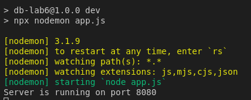
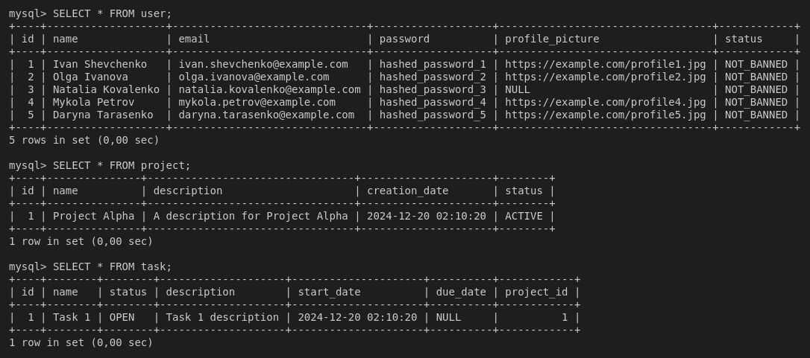

# Тестування працездатності системи

Для тестування було використано Thunder Client.
Реалізовано таблиці user, project, task.

**Запуск програми**

  
  
## Початкове наповнення БД
  
  
## User

**Get /users**

**Post**

**Get /users/id**

**Put**

**Delete**

## Project

**Get /projects**

**Post**

**Get /projects/id**

**Put**

**Delete**

## Task

**Get /tasks**

**Post**

**Get /tasks/id**

**Put**

**Delete**

